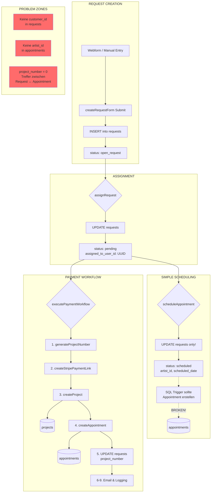

# REQUEST FUNNEL - FRONTEND LOGIK ANALYSE

**Analysierte Datei:** `management-system (19).html`
**Datum:** 2025-12-02
**Kontext:** Culture over Money Tattoo Management System

---

## 1. REQUEST FUNKTIONEN

### `loadRequests()`
**Zeile:** ~7377
**Zweck:** Laedt alle Requests aus der Datenbank mit Relations
**Tabellen:** `requests` (SELECT mit JOINs)
**Verknuepfungen:**
- `customer:customers(id, first_name, last_name, email, phone, rank, instagram)`
- `artist:artists(id, name, email, instagram)`
- `location:locations(id, name, city)`

**Query:**
```javascript
const { data, error } = await supabase
  .from('requests')
  .select(`
    *,
    customer:customers(...),
    artist:artists(...),
    location:locations(...)
  `)
  .order('created_at', { ascending: false });
```

**Filter-Logik:**
- `my-requests`: Filter nach `assigned_to_user_id === currentUser?.id`
- Status-Filter: `open_request`, `pending`, `scheduled`, `finished`
- Location-Filter: `mommy`, `gon`, `muttersohne`, `pardon`

**Problem:** Laedt ALLE Requests (34.000+) auf einmal - keine Paginierung!

---

### `showRequestDetail(requestId)`
**Zeile:** ~7598
**Zweck:** Zeigt Request-Details im rechten Panel
**Tabellen:** Keine (verwendet gecachte `allRequests`)

**Status-Actions:**
| Status | Action Button |
|--------|---------------|
| `open_request` | "Assign to Team Member" |
| `pending` | "Schedule Appointment" + "Zahlungsabwicklung starten" |
| `scheduled` | Edit/Reset/Cancel/Delete |

**Problem:** Kundendaten werden aus Request-Tabelle gelesen (Duplikation), Customer-Relation nur fuer `rank` und `instagram`

---

### `createRequestForm` Submit Handler
**Zeile:** ~8847
**Zweck:** Erstellt neuen Request
**Tabellen:** `requests` (INSERT)

**Gesetzte Felder:**
```javascript
{
  first_name, last_name, email, customer_phone,
  instagram, priority, placement, size, style,
  colorway, description, location_id,
  status: 'open_request',
  origin: [Booking form|Whatsapp|Instagram|...],
  booking_type: 'request'
}
```

**KRITISCHES PROBLEM:**
- Kein `customer_id` wird gesetzt!
- Kein Customer-Lookup/Creation
- Customer-Daten werden direkt in Request dupliziert

---

## 2. ASSIGNMENT FUNKTIONEN

### `assignRequest()`
**Zeile:** ~7953
**Zweck:** Weist Request einem Team-Mitglied zu
**Tabellen:** `requests` (UPDATE)

**Hardcoded Team Members:**
```javascript
const teamMembers = [
  { id: 'b67d032d-...', username: 'Cara' },
  { id: '4048a85a-...', username: 'Aman' },
  { id: '48c82f73-...', username: 'Bennett' },
  { id: 'feb0f09d-...', username: 'Fay' },
  { id: 'feef5b54-...', username: 'Jan' }
];
```

**Update:**
```javascript
.update({
  status: 'pending',
  assigned_to_user_id: userId,
  assigned_to: userId  // BUG: Setzt UUID statt Username!
})
```

**Problem:** `assigned_to` sollte Username sein, wird aber mit UUID befuellt

---

### `scheduleAppointment()` (Simple Version)
**Zeile:** ~8002
**Zweck:** Setzt Termin-Details auf Request
**Tabellen:** `requests` (UPDATE), `artists` (SELECT)

**Update:**
```javascript
.update({
  status: 'scheduled',
  artist_id: artistId,
  artist_name: artist?.name,
  scheduled_date: date,
  start_time: startTime,
  end_time: endTime
})
```

**KRITISCHES PROBLEM:**
- KEIN Appointment wird in `appointments` Tabelle erstellt!
- Nur Request wird updated
- Kommentar sagt: "Appointment auto-created by SQL trigger" - aber SQL-Analyse zeigt: Trigger existiert, funktioniert aber nicht korrekt!

---

## 3. PAYMENT WORKFLOW FUNKTIONEN

### `openPaymentWorkflowModal(requestId)`
**Zeile:** ~19660
**Zweck:** Oeffnet Payment-Modal fuer Request
**Tabellen:** `requests` (SELECT)

**Validierung:**
- Request muss existieren
- Noch kein `stripe_payment_link` vorhanden

---

### `generateProjectNumber()`
**Zeile:** ~19861
**Zweck:** Generiert eindeutige Project Number
**Tabellen:** `projects` (SELECT)

**Format:** `P` + YYYY + MM + 3-stellige Sequenz
**Beispiel:** `P202511058`

```javascript
const prefix = `P${year}${month}`; // P202511
// Findet hoechste Nummer fuer diesen Monat
const { data } = await supabase
  .from('projects')
  .select('project_number')
  .like('project_number', `${prefix}%`)
  .order('project_number', { ascending: false })
  .limit(1);
```

---

### `createProject(requestData, projectNumber, totalPrice, stripePaymentLink)`
**Zeile:** ~19908
**Zweck:** Erstellt Project in projects Tabelle
**Tabellen:** `projects` (INSERT)

**Gesetzte Felder:**
```javascript
{
  project_number: projectNumber,
  customer_email: requestData.customer?.email || requestData.email,
  title: `Tattoo - ${requestData.placement || 'Custom Design'}`,
  description: requestData.description,
  bodypart: requestData.placement,
  tattoosize: requestData.size,
  style: requestData.style,
  model: requestData.colorway,
  work_process: null,
  state: 'pending',
  price: totalPrice,
  payment_state: 'awaiting_payment',
  payment_intent: stripePaymentLink  // Stripe Link!
}
```

**PROBLEM:** Kein `customer_id` - nur `customer_email`!

---

### `createAppointment(requestData, projectId, projectNumber)`
**Zeile:** ~19956
**Zweck:** Erstellt Appointment in appointments Tabelle
**Tabellen:** `appointments` (INSERT)

**Gesetzte Felder:**
```javascript
{
  artist_email: requestData.artist?.email || null,
  customer_email: requestData.customer?.email || requestData.email,
  project_id: projectId,
  project_number: projectNumber,
  creator_email: currentUser?.email,
  wannado_id: null,
  state: 'scheduled',
  work_process: null,
  start: startDateTime.toISOString(),
  end: endDateTime.toISOString(),
  notice: requestData.notes
}
```

**KRITISCHE PROBLEME:**
- Kein `artist_id` - nur `artist_email`!
- Kein `customer_id` - nur `customer_email`!
- Kein `location_id`!
- Kein `request_id` fuer Rueckverknuepfung!

---

### `executePaymentWorkflow()`
**Zeile:** ~20019
**Zweck:** Vollstaendiger Payment-Workflow
**Tabellen:** `projects` (INSERT), `appointments` (INSERT), `requests` (UPDATE)

**Workflow-Schritte:**
1. `generateProjectNumber()` - Project Number generieren
2. `createStripePaymentLink()` - Stripe Payment Link erstellen
3. `createProject()` - Project in DB anlegen
4. `createAppointment()` - Appointment in DB anlegen
5. Request updaten mit `project_number`, `stripe_payment_link`
6. `logPaymentAction()` - Aktion loggen
7. `sendPaymentConfirmationEmail()` - Email versenden
8. `payment_confirmation_email_sent` Flag setzen
9. Email-Aktion loggen

**Request Update (Zeile ~20097):**
```javascript
.update({
  project_number: projectNumber,
  stripe_payment_link: paymentLink.url,
  payment_link_sent_at: new Date().toISOString(),
  booking_team_member_name: currentUser?.username
})
```

---

### `createStripePaymentLink(requestData, totalPrice)`
**Zeile:** ~20248
**Zweck:** Erstellt Stripe Payment Link via API
**Tabellen:** Keine (External API)

**Stripe Metadata:**
```javascript
'metadata[customer_id]': requestData.customer_id || '',
'metadata[request_id]': requestData.id,
'metadata[artist_id]': requestData.artist_id || '',
'metadata[location_id]': requestData.location_id || ''
```

---

## 4. CUSTOMER HANDLING

### Customer Insert (nur bei "Add Customer")
**Zeile:** ~10767
**Zweck:** Manuelles Hinzufuegen eines Customers
**Tabellen:** `customers` (INSERT)

```javascript
await supabase.from('customers').insert({
  first_name, last_name, email,
  phone: phone || null,
  instagram: instagram || null,
  rank: rank || null
});
```

**KRITISCHES PROBLEM:**
- Bei Request-Erstellung wird KEIN Customer erstellt!
- Kein `findOrCreateCustomer()` existiert!
- Customer-Daten werden in `requests` Tabelle dupliziert

---

## 5. ARTIST ASSIGNMENT

### Artist Search (Edit Form)
**Zeile:** ~8717
**Zweck:** Artist-Suche fuer Request-Zuweisung

```javascript
const filteredArtists = allArtists.filter(artist =>
  artist.name.toLowerCase().includes(query)
);
```

**Beim Speichern:**
```javascript
artist_id: selectedArtistId,
artist_name: selectedArtistName  // Redundant!
```

**Problem:** Artist wird in Request gesetzt, aber NICHT in Appointment uebertragen!

---

## A) WORKFLOW DIAGRAMM (Mermaid)



---

## B) DATEN-MAPPING: Request → Appointment

| Request Feld | Appointment Feld | Status |
|--------------|------------------|--------|
| `id` | - | **NICHT UEBERTRAGEN** |
| `customer_id` | `customer_id` | **NICHT GESETZT** (nur email) |
| `artist_id` | `artist_id` | **NICHT UEBERTRAGEN** (nur email) |
| `location_id` | `location_id` | **NICHT UEBERTRAGEN** |
| `scheduled_date` | `start` | Teilweise (als DateTime) |
| `start_time` | `start` | Kombiniert mit date |
| `end_time` | `end` | Kombiniert mit date |
| `project_number` | `project_number` | ✅ Uebertragen |
| `project_id` | `project_id` | ✅ Uebertragen |
| `email` | `customer_email` | ✅ Uebertragen |
| `notes` | `notice` | ✅ Uebertragen |
| `placement` | - | **NICHT UEBERTRAGEN** |
| `size` | - | **NICHT UEBERTRAGEN** |
| `style` | - | **NICHT UEBERTRAGEN** |
| `description` | - | **NICHT UEBERTRAGEN** |

---

## C) IDENTIFIZIERTE GAPS

### GAP 1: Fehlende Customer-Verknuepfung
**Code:**
```javascript
// Request wird erstellt OHNE customer_id
const requestData = {
  first_name: ...,
  last_name: ...,
  email: ...,
  // customer_id: FEHLT!
};
```
**DB-Realitaet:** 34.000 Requests, viele ohne `customer_id`

---

### GAP 2: Zwei Wege zu "Scheduled" - nur einer erstellt Appointments
1. **scheduleAppointment()** → Nur Request UPDATE → **KEIN Appointment erstellt!**
2. **executePaymentWorkflow()** → Project + Appointment + Request UPDATE → ✅

**Kommentar im Code (Zeile 8812):**
```javascript
// ✅ Request scheduled - Appointment auto-created by SQL trigger
```
Aber: SQL-Analyse zeigt 0 Treffer bei project_number Matching!

---

### GAP 3: artist_id wird nicht in Appointment uebertragen
**createAppointment() setzt:**
```javascript
artist_email: requestData.artist?.email || null,
// ABER NICHT: artist_id!
```

**Appointments Tabelle:** Hat `artist_id` Spalte, wird aber nicht befuellt via Frontend!

---

### GAP 4: Hardcoded Team Members
```javascript
const teamMembers = [
  { id: 'b67d032d-...', username: 'Cara' },
  // ... hardcoded UUIDs!
];
```
Keine dynamische Abfrage aus `profiles` Tabelle.

---

### GAP 5: assigned_to Bug
```javascript
.update({
  assigned_to_user_id: userId,
  assigned_to: userId  // SOLLTE username sein!
})
```
Setzt UUID statt Username in `assigned_to` Feld.

---

### GAP 6: Keine location_id in Appointments
**createAppointment()** uebertraegt keine `location_id` aus Request.
Appointments ohne Location koennen nicht gefiltert werden.

---

### GAP 7: Kein request_id in Appointments
Keine Rueckverknuepfung vom Appointment zum urspruenglichen Request.
Nur ueber `project_number` moeglich - aber diese wird erst beim Payment Workflow gesetzt.

---

## D) QUICK WINS

### Quick Win 1: customer_id bei Request-Erstellung setzen
```javascript
// Bei createRequestForm Submit:
const existingCustomer = await supabase
  .from('customers')
  .select('id')
  .eq('email', email)
  .single();

if (existingCustomer.data) {
  requestData.customer_id = existingCustomer.data.id;
} else {
  const { data: newCustomer } = await supabase
    .from('customers')
    .insert({ first_name, last_name, email, phone })
    .select('id')
    .single();
  requestData.customer_id = newCustomer.id;
}
```

---

### Quick Win 2: artist_id in createAppointment() setzen
```javascript
const appointmentData = {
  artist_id: requestData.artist_id || null,  // HINZUFUEGEN!
  artist_email: requestData.artist?.email || null,
  // ...
};
```

---

### Quick Win 3: location_id in createAppointment() setzen
```javascript
const appointmentData = {
  location_id: requestData.location_id || null,  // HINZUFUEGEN!
  // ...
};
```

---

### Quick Win 4: assigned_to Bug fixen
```javascript
const teamMember = teamMembers.find(m => m.id === userId);
.update({
  assigned_to_user_id: userId,
  assigned_to: teamMember?.username || userId  // Username statt UUID
})
```

---

### Quick Win 5: scheduleAppointment() auch Appointment erstellen lassen
Der "Schedule Appointment" Button sollte dieselbe Logik wie `executePaymentWorkflow()` nutzen - oder zumindest einen Appointment-Eintrag erstellen.

---

## ZUSAMMENFASSUNG

| Bereich | Status | Kritikalitaet |
|---------|--------|---------------|
| Request Loading | ⚠️ Keine Paginierung | Mittel |
| Customer Linking | ❌ Nicht implementiert | **HOCH** |
| Artist Assignment | ⚠️ Nur in Request, nicht in Appointment | **HOCH** |
| Location Tracking | ❌ Nicht in Appointments | Mittel |
| Payment Workflow | ✅ Funktioniert | - |
| Simple Scheduling | ❌ Erstellt keine Appointments | **KRITISCH** |
| Project System | ✅ Funktioniert im Payment Workflow | - |
| Request→Appointment Link | ❌ Nur via project_number | **HOCH** |

---

**Naechste Schritte:**
1. `findOrCreateCustomer()` implementieren
2. `scheduleAppointment()` mit Appointment-Erstellung erweitern
3. artist_id + location_id in createAppointment() uebertragen
4. request_id in Appointments speichern fuer Rueckverknuepfung
