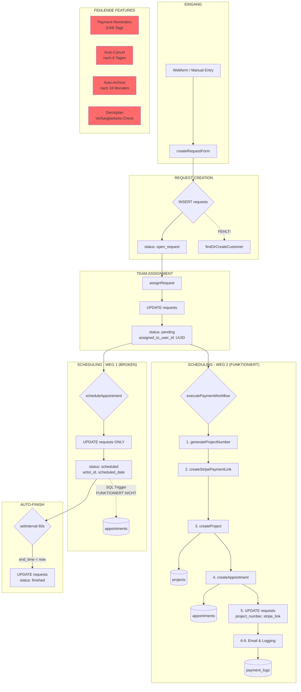

# REQUEST FUNNEL - VOLLSTAENDIGE SYSTEM-ANALYSE

**Analysierte Datei:** `management-system (19).html` (Version v84)
**Datum:** 2025-12-02
**Dateigroesse:** 804.5 KB
**Status:** NUR ANALYSE - KEINE AENDERUNGEN

---

## 1. EXECUTIVE SUMMARY

### Was funktioniert:
- Request-Erstellung (manuell) mit allen Tattoo-Details
- Request-Liste mit Status-Filterung (open_request, pending, scheduled, finished, canceled, archived)
- Location-basierte Filterung (Mommy, Gon, Muttersöhne, Pardon)
- Team-Zuweisung (assignRequest)
- Payment Workflow mit Stripe + Email (executePaymentWorkflow)
- Kalender-Ansicht fuer Appointments
- Customer/Artist CRUD-Operationen
- Reference Image Upload zu Requests
- Auto-Refresh fuer Request-Liste

### Was teilweise funktioniert:
- scheduleAppointment() - Updated nur Request, KEIN Appointment wird erstellt
- Customer-Verknuepfung - Nur manuell bei "Add Customer", nicht bei Request-Erstellung
- Project-System - Nur im Payment Workflow, nicht beim einfachen Scheduling

### Was FEHLT:
- Payment Reminder (2/4/6 Tage) - NICHT IMPLEMENTIERT
- Auto-Cancel nach 6 Tagen ohne Zahlung - NICHT IMPLEMENTIERT
- Auto-Archive nach 18 Monaten - NICHT IMPLEMENTIERT
- Follow-Up Projekt (bestehendes Projekt auswaehlen) - NICHT IMPLEMENTIERT
- Dienstplan-Verfuegbarkeitspruefung beim Scheduling - NICHT IMPLEMENTIERT
- customer_id automatisch bei Request setzen - NICHT IMPLEMENTIERT

---

## 2. FUNKTIONS-KATALOG

### 2.1 REQUEST FUNKTIONEN

#### `loadRequests()`
**Zeile:** ~7377
**Zweck:** Laedt alle Requests aus Supabase mit JOINs
**Tabellen (READ):** `requests`, `customers`, `artists`, `locations`
**Tabellen (WRITE):** Keine
**Query:**
```javascript
.from('requests')
.select(`*, customer:customers(...), artist:artists(...), location:locations(...)`)
.order('created_at', { ascending: false });
```
**Aufgerufen von:** Tab-Wechsel, Auto-Refresh (alle 30 Sekunden), nach jeder Aenderung
**Ruft auf:** `renderRequestsList()`, `updateRequestBadges()`
**Problem:** Laedt ALLE 34.000+ Requests ohne Paginierung!

---

#### `showRequestDetail(requestId)`
**Zeile:** ~7598
**Zweck:** Zeigt Request-Details im rechten Panel
**Tabellen (READ):** Keine (verwendet gecachte `allRequests`)
**Tabellen (WRITE):** Keine
**Status-spezifische Actions:**
| Status | Button | Funktion |
|--------|--------|----------|
| open_request | "Assign to Team Member" | `assignRequest()` |
| pending | "Schedule Appointment" | `scheduleAppointment()` |
| pending (ohne stripe_link) | "Zahlungsabwicklung starten" | `openPaymentWorkflowModal()` |
| scheduled | Edit/Reset/Cancel/Delete | Diverse |

---

#### `createRequestForm` Submit Handler
**Zeile:** ~8847
**Zweck:** Erstellt neuen Request
**Tabellen (READ):** Keine
**Tabellen (WRITE):** `requests` (INSERT)
**Gesetzte Felder:**
```javascript
{
  first_name, last_name, email, customer_phone,
  instagram, priority, placement, size, style,
  colorway, description, location_id,
  status: 'open_request',
  origin: [Booking form|Whatsapp|Instagram|...],
  booking_type: 'request'
}
```
**KRITISCH:** `customer_id` wird NICHT gesetzt!

---

#### `assignRequest()`
**Zeile:** ~7953
**Zweck:** Weist Request einem Team-Mitglied zu
**Tabellen (READ):** Keine (hardcoded)
**Tabellen (WRITE):** `requests` (UPDATE)
**Hardcoded Team Members:**
```javascript
const teamMembers = [
  { id: 'b67d032d-5206-498f-b4ec-0e145d468052', username: 'Cara' },
  { id: '4048a85a-7018-4003-b4a1-41b05676c758', username: 'Aman' },
  { id: '48c82f73-8e00-437f-af32-b1ec13b12d4e', username: 'Bennett' },
  { id: 'feb0f09d-4461-44c5-a769-67a7716ba7ad', username: 'Fay' },
  { id: 'feef5b54-4506-4324-af8b-1617636e3ee2', username: 'Jan' }
];
```
**Status-Aenderung:** `open_request` → `pending`
**BUG:** `assigned_to` wird mit UUID statt Username befuellt!

---

#### `scheduleAppointment()`
**Zeile:** ~8002
**Zweck:** Plant Termin fuer Request
**Tabellen (READ):** `artists` (SELECT)
**Tabellen (WRITE):** `requests` (UPDATE)
**Update-Felder:**
```javascript
{
  status: 'scheduled',
  artist_id: artistId,
  artist_name: artist?.name,
  scheduled_date: date,
  start_time: startTime,
  end_time: endTime
}
```
**KRITISCHES PROBLEM:**
- Erstellt KEIN Appointment in `appointments` Tabelle!
- Nur Request wird updated
- Kommentar sagt "SQL trigger" - aber dieser funktioniert nicht!

---

#### `editRequest(requestId)`
**Zeile:** ~8094
**Zweck:** Oeffnet Request im Edit-Modus
**Tabellen (READ):** Keine (verwendet Cache)
**Tabellen (WRITE):** Keine (erst bei Save)

---

#### `saveFullFrameEdit()`
**Zeile:** ~8585
**Zweck:** Speichert Request-Aenderungen
**Tabellen (WRITE):** `requests` (UPDATE)
**Spezial:** Wenn Status auf 'scheduled' geaendert wird, erscheint Alert ueber SQL-Trigger

---

#### `deleteRequest()` / `deleteRequestPermanently()`
**Zeile:** ~9068 / ~8926
**Zweck:** Loescht Request
**Tabellen (WRITE):** `requests` (DELETE)
**Sicherheit:** Doppelte Bestaetigung + "DELETE" tippen

---

#### `uploadReferenceImages(files)`
**Zeile:** ~8433
**Zweck:** Laedt Referenzbilder zum Request hoch
**Tabellen (READ):** Keine
**Tabellen (WRITE):** `requests` (UPDATE reference_images Array)
**Storage:** Supabase Storage Bucket 'reference-images'

---

### 2.2 APPOINTMENT FUNKTIONEN

#### `loadEvents()` (Kalender-Daten)
**Zeile:** ~9841
**Zweck:** Laedt Kalender-Events (Appointments + Events + Artist Infos)
**Tabellen (READ):** `appointments`, `events`, `artist_infos`, `locations`
**Paginierung:** Ja (1000 pro Batch)

---

#### `showAppointmentDetails(appointmentId)`
**Zeile:** ~12541
**Zweck:** Zeigt Appointment-Details
**Tabellen (READ):** `appointments` mit JOINs zu `customers`, `artists`, `locations`

---

#### `saveAppointmentState(appointmentId)`
**Zeile:** ~12893
**Zweck:** Speichert Appointment-State Aenderung
**Tabellen (WRITE):** `appointments` (UPDATE state)
**Kommentar:** "SQL trigger will automatically update status based on state + end time"

---

#### `createBooking()`
**Zeile:** ~10141
**Zweck:** Oeffnet Modal fuer neues Booking
**Hinweis:** Erstellt in `events` Tabelle, NICHT in `appointments`!

---

### 2.3 CUSTOMER FUNKTIONEN

#### `loadCustomers(page)`
**Zeile:** ~9350
**Zweck:** Laedt Kunden mit Paginierung
**Tabellen (READ):** `customers`
**Paginierung:** Ja (1000 pro Batch)

---

#### `showCustomerDetail(customerId)`
**Zeile:** ~9726
**Zweck:** Zeigt Kunden-Details
**Tabellen (READ):** `customers`

---

#### `openCustomerProfile(customerId)`
**Zeile:** ~11355
**Zweck:** Zeigt vollstaendiges Kunden-Profil mit Requests und Appointments
**Tabellen (READ):** `customers`, `requests`, `appointments`

---

#### Customer INSERT (Add Customer Form)
**Zeile:** ~10767
**Zweck:** Erstellt neuen Kunden
**Tabellen (WRITE):** `customers` (INSERT)
**WICHTIG:** Nur manuell - NICHT automatisch bei Request-Erstellung!

---

### 2.4 ARTIST FUNKTIONEN

#### `loadArtists(page)`
**Zeile:** ~9138
**Zweck:** Laedt Artists
**Tabellen (READ):** `artists` mit JOIN zu `locations`

---

#### `viewArtistProfile(artistId)`
**Zeile:** ~10895
**Zweck:** Zeigt Artist-Profil mit Projekten
**Tabellen (READ):** `appointments` fuer Artist-Projekte

---

### 2.5 PROJECT FUNKTIONEN

#### `generateProjectNumber()`
**Zeile:** ~19861
**Zweck:** Generiert eindeutige Projekt-Nummer
**Tabellen (READ):** `projects` (SELECT hoechste Nummer des Monats)
**Format:** `P` + YYYY + MM + 3-stellige Sequenz
**Beispiel:** `P202512001`

---

#### `createProject(requestData, projectNumber, totalPrice, stripePaymentLink)`
**Zeile:** ~19908
**Zweck:** Erstellt Projekt in projects Tabelle
**Tabellen (WRITE):** `projects` (INSERT)
**Gesetzte Felder:**
```javascript
{
  project_number, customer_email, title,
  description, bodypart, tattoosize, style, model,
  state: 'pending', price, payment_state: 'awaiting_payment',
  payment_intent: stripePaymentLink
}
```
**PROBLEM:** Kein `customer_id` - nur `customer_email`!

---

#### `createAppointment(requestData, projectId, projectNumber)`
**Zeile:** ~19956
**Zweck:** Erstellt Appointment in appointments Tabelle
**Tabellen (WRITE):** `appointments` (INSERT)
**Gesetzte Felder:**
```javascript
{
  artist_email, customer_email, project_id, project_number,
  creator_email, state: 'scheduled', start, end, notice
}
```
**KRITISCHE PROBLEME:**
- Kein `artist_id` - nur `artist_email`!
- Kein `customer_id` - nur `customer_email`!
- Kein `location_id`!
- Kein `request_id` fuer Rueckverknuepfung!

---

### 2.6 PAYMENT FUNKTIONEN

#### `openPaymentWorkflowModal(requestId)`
**Zeile:** ~19656
**Zweck:** Oeffnet Payment-Modal
**Tabellen (READ):** `requests` mit allen Relations
**Validierung:** Status muss 'pending' sein, kein existierender stripe_payment_link

---

#### `executePaymentWorkflow()`
**Zeile:** ~20019
**Zweck:** Vollstaendiger 9-Step Payment Workflow
**Schritte:**
1. `generateProjectNumber()` - Project Number generieren
2. `createStripePaymentLink()` - Stripe Payment Link erstellen
3. `createProject()` - Project in DB anlegen
4. `createAppointment()` - Appointment in DB anlegen
5. `requests.update()` - Request mit project_number updaten
6. `logPaymentAction()` - Aktion loggen
7. `sendPaymentConfirmationEmail()` - Email versenden
8. `requests.update()` - Email Flag setzen
9. `logPaymentAction()` - Email-Aktion loggen

**Tabellen (WRITE):** `projects`, `appointments`, `requests`, `payment_logs`

---

#### `createStripePaymentLink(requestData, totalPrice)`
**Zeile:** ~20248
**Zweck:** Erstellt Stripe Payment Link via API
**External API:** `https://api.stripe.com/v1/payment_links`
**Metadata:** customer_id, request_id, artist_id, location_id

---

### 2.7 EMAIL FUNKTIONEN

#### `sendPaymentConfirmationEmail(requestData, paymentLink, totalPrice, depositAmount, projectNumber)`
**Zeile:** ~20308
**Zweck:** Versendet Payment-Bestaetigungsmail
**External API:** `https://api.resend.com/emails` (Resend)
**Konfiguration:**
```javascript
const EMAIL_FROM = 'onboarding@resend.dev';
const EMAIL_REPLY_TO = 'info@mommyimsorry.com';
```

**FEHLENDE EMAILS:**
- Payment Reminder (2 Tage) - NICHT IMPLEMENTIERT
- Payment Reminder (4 Tage) - NICHT IMPLEMENTIERT
- Auto-Cancel Benachrichtigung (6 Tage) - NICHT IMPLEMENTIERT
- Payment Success Email - NICHT IMPLEMENTIERT

---

### 2.8 DIENSTPLAN FUNKTIONEN

#### `renderDienstplan()`
**Zeile:** ~13360
**Zweck:** Rendert Dienstplan-Kalender
**Tabellen (READ):** Keine direkt (verwendet gecachte Daten)

---

#### `loadDienstplanData()`
**Zeile:** ~13785
**Zweck:** Laedt Arbeitszeiten
**Tabellen (READ):** `working_times`
**Paginierung:** Ja

---

#### `loadDienstplanRequests()`
**Zeile:** ~13634
**Zweck:** Laedt pending Requests fuer Dienstplan-Ansicht
**Tabellen (READ):** `requests` (status = pending)

**FEHLENDE INTEGRATION:**
- Keine Verfuegbarkeitspruefung beim Request Scheduling!
- Kein Check ob Artist arbeitet
- Kein Check ob Artist bereits Termin hat

---

### 2.9 AUTO-FINISH FUNKTION

**Zeile:** ~9091
**Zweck:** Automatisch `scheduled` → `finished` bei Termin-Ablauf
**Implementierung:**
```javascript
setInterval(async () => {
  const now = new Date();
  const scheduledRequests = allRequests.filter(
    r => r.status === 'scheduled' && r.scheduled_date && r.end_time
  );

  for (const req of scheduledRequests) {
    const endDateTime = new Date(`${req.scheduled_date}T${req.end_time}`);
    if (now > endDateTime) {
      await supabase.from('requests').update({ status: 'finished' }).eq('id', req.id);
    }
  }
}, 60000); // Alle 60 Sekunden
```
**Tabellen (WRITE):** `requests` (UPDATE status)
**PROBLEM:** Nur fuer Requests, NICHT fuer Appointments!

---

## 3. DATENFLUSS-DIAGRAMM



---

## 4. STATUS-TRANSITIONS

### 4.1 Request Status

| Von | Nach | Funktion | Zeile | Automatisch? |
|-----|------|----------|-------|--------------|
| (neu) | open_request | createRequestForm | ~8864 | Ja |
| open_request | pending | assignRequest | ~7982 | Nein |
| pending | scheduled | scheduleAppointment | ~8035 | Nein |
| pending | scheduled | executePaymentWorkflow (via saveFullFrameEdit) | ~8796 | Nein |
| scheduled | finished | setInterval Auto-Check | ~9100 | Ja (jede Minute) |
| * | canceled | cancelAppointment | ~8074 | Nein |
| * | open_request | resetRequestToOpen | ~8898 | Nein |

### 4.2 Payment Status

| Von | Nach | Funktion | Zeile | Implementiert? |
|-----|------|----------|-------|----------------|
| - | awaiting_payment | createProject | ~19924 | Ja |
| awaiting_payment | deposit_paid | ? | ? | **NEIN - Stripe Webhook fehlt!** |
| deposit_paid | fully_paid | ? | ? | **NEIN - Stripe Webhook fehlt!** |
| * | refunded | ? | ? | **NEIN** |

### 4.3 Appointment Status

| Von | Nach | Funktion | Zeile | Implementiert? |
|-----|------|----------|-------|----------------|
| - | scheduled | createAppointment | ~19981 | Ja |
| scheduled | finished | ? | ? | **NEIN - Nur Request hat Auto-Finish!** |
| * | canceled | ? | ? | **NEIN** |
| * | no_show | saveAppointmentState | ~12908 | Ja (manuell) |
| * | rescheduled | saveAppointmentState | ~12908 | Ja (manuell) |

---

## 5. DATEN-MAPPING: Request → Appointment

| Request Feld | Appointment Feld | Wird uebertragen? | Zeile |
|--------------|------------------|-------------------|-------|
| `id` | `request_id` | **NEIN** | - |
| `customer_id` | `customer_id` | **NEIN** (nur email) | ~19976 |
| `artist_id` | `artist_id` | **NEIN** (nur email) | ~19975 |
| `location_id` | `location_id` | **NEIN** | - |
| `scheduled_date` + `start_time` | `start` | Ja (kombiniert) | ~19983 |
| `scheduled_date` + `end_time` | `end` | Ja (kombiniert) | ~19984 |
| `project_number` | `project_number` | Ja | ~19978 |
| - | `project_id` | Ja (vom neuen Project) | ~19977 |
| `email` / `customer.email` | `customer_email` | Ja | ~19976 |
| `artist.email` | `artist_email` | Ja | ~19975 |
| `notes` | `notice` | Ja | ~19985 |
| `placement` | - | **NEIN** | - |
| `size` | - | **NEIN** | - |
| `style` | - | **NEIN** | - |
| `colorway` | - | **NEIN** | - |
| `description` | - | **NEIN** | - |
| `reference_images` | - | **NEIN** | - |
| `priority` | - | **NEIN** | - |

---

## 6. SUPABASE TABELLEN-NUTZUNG

### 6.1 requests
| Operation | Zeilen |
|-----------|--------|
| SELECT | 6431, 7384, 11382, 15755, 15777, 15854, 15876, 17078, 17180, 19658 |
| INSERT | 8870 |
| UPDATE | 7981, 8033, 8072, 8493, 8544, 8609, 8657, 8795, 8897, 9012, 9042, 9100, 20098, 20156 |
| DELETE | 8699, 8950, 9075 |

### 6.2 appointments
| Operation | Zeilen |
|-----------|--------|
| SELECT | 6479, 6809, 7159, 7285, 9926, 11003, 11395, 12546, 12907, 12985, 15628, 15650, 17091, 17108, 17118, 17221, 18198, 18328 |
| INSERT | 19995 |
| UPDATE | 12907 |
| DELETE | - |

### 6.3 customers
| Operation | Zeilen |
|-----------|--------|
| SELECT | 6540, 9369, 9731, 11229, 11325, 11366, 11837, 11852, 11884, 11905 |
| INSERT | 10767 |
| UPDATE | 11292, 11837 |
| DELETE | 11338, 11905 |

### 6.4 artists
| Operation | Zeilen |
|-----------|--------|
| SELECT | 6125, 6544, 7142, 7172, 8004, 8027, 8977, 9006, 9148, 13914, 19044 |
| INSERT | 10719 |
| UPDATE | 10840 |
| DELETE | 10878, 11198 |

### 6.5 projects
| Operation | Zeilen |
|-----------|--------|
| SELECT | 16383, 18497, 19872 |
| INSERT | 19934 |
| UPDATE | - |
| DELETE | - |

### 6.6 events
| Operation | Zeilen |
|-----------|--------|
| SELECT | 9782, 9873, 12284, 12958 |
| INSERT | 12053, 12231 |
| UPDATE | 9821, 12473, 13158, 13272 |
| DELETE | 12406, 13197, 13308 |

### 6.7 locations
| Operation | Zeilen |
|-----------|--------|
| SELECT | 6130, 10103, 10689, 18604, 19048 |

### 6.8 working_times (Dienstplan)
| Operation | Zeilen |
|-----------|--------|
| SELECT | 13810 |
| INSERT | 13756 |

### 6.9 payment_logs
| Operation | Zeilen |
|-----------|--------|
| INSERT | 20651 |

---

## 7. GLOBALE VARIABLEN

| Variable | Zeile | Typ | Gefuellt von | Zweck |
|----------|-------|-----|--------------|-------|
| `allRequests` | 7371 | Array | `loadRequests()` | Cache aller Requests |
| `allArtists` | 5547 | Array | `loadInitialData()` | Cache aller Artists |
| `allLocations` | 5549 | Array | `loadInitialData()` | Cache aller Locations |
| `allTeamMembers` | 5548 | Array | `loadInitialData()` | Cache der Team Members |
| `allCustomers` | 9342 | Array | `loadCustomers()` | Cache aller Customers |
| `selectedRequestId` | 7374 | String | Click-Handler | Aktuell ausgewaehlter Request |
| `currentRequestStatus` | 7372 | String | Tab-Handler | Aktueller Status-Filter |
| `currentRequestLocation` | 7373 | String | Location-Tab | Aktueller Location-Filter |
| `editingRequestId` | 8092 | String | `editRequest()` | Request im Edit-Modus |
| `currentPaymentRequest` | - | Object | `openPaymentWorkflowModal()` | Request im Payment-Modal |
| `selectedLocationId` | 5556 | String | Location-Dropdown | Kalender-Location |
| `selectedDienstplanLocationId` | 5557 | String | Dienstplan-Dropdown | Dienstplan-Location |
| `currentDate` | 5541 | Date | Navigation | Kalender-Datum |
| `dienstplanDate` | 5542 | Date | Navigation | Dienstplan-Datum |
| `events` | 5544 | Array | `loadEvents()` | Kalender-Events Cache |

---

## 8. EVENT LISTENER (Request-Bereich)

| Element | Event | Handler | Zeile |
|---------|-------|---------|-------|
| `.request-tab` | click | Tab-Switch + Filter | ~5830 |
| `.request-location-tab` | click | Location-Filter | ~5910 |
| `#createRequestBtn` | click | Open Modal | ~8824 |
| `#createRequestForm` | submit | Create Request | ~8847 |
| `#cancelCreateRequest` | click | Close Modal | ~8841 |
| `#assignForm` | submit | Assign Request | ~8974 |
| `#scheduleForm` | submit | Schedule Request | ~8016 |
| `#cancelForm` | submit | Cancel Request | ~8065 |
| `.request-item` | click | Select Request | ~7573 |

---

## 9. GAP-ANALYSE: Gewuenscht vs. Implementiert

### 9.1 Payment Reminder System

| Feature | Gewuenscht | Implementiert | Zeile |
|---------|------------|---------------|-------|
| Reminder nach 2 Tagen | Ja | **NEIN** | - |
| Reminder nach 4 Tagen | Ja | **NEIN** | - |
| Auto-Cancel nach 6 Tagen | Ja | **NEIN** | - |
| Storno-Email bei Cancel | Ja | **NEIN** | - |
| Payment Success Email | Ja | **NEIN** | - |

### 9.2 Auto-Status-Updates

| Feature | Gewuenscht | Implementiert | Zeile |
|---------|------------|---------------|-------|
| Request → finished bei Termin-Ende | Ja | **JA** | ~9091 |
| Appointment → finished bei Termin-Ende | Ja | **NEIN** | - |
| Request → archived nach 18 Monaten | Ja | **NEIN** | - |

### 9.3 Follow-Up Projekt

| Feature | Gewuenscht | Implementiert | Zeile |
|---------|------------|---------------|-------|
| Bestehendes Projekt auswaehlen | Ja | **NEIN** | - |
| Projekt-Suche nach Customer | Ja | **NEIN** | - |

### 9.4 Referenzbilder

| Feature | Gewuenscht | Implementiert | Zeile |
|---------|------------|---------------|-------|
| Upload bei Request | Ja | **JA** | ~8433 |
| Uebertragung zu Appointment | Ja | **NEIN** | - |
| Anzeige in Appointment-Detail | Ja | **NEIN** | - |

### 9.5 Dienstplan-Integration

| Feature | Gewuenscht | Implementiert | Zeile |
|---------|------------|---------------|-------|
| Artist arbeitet an Tag? | Ja | **NEIN** | - |
| Artist bereits Termin? | Ja | **NEIN** | - |
| Slot-Konflikt-Check | Ja | **NEIN** | - |

### 9.6 Customer-Verknuepfung

| Feature | Gewuenscht | Implementiert | Zeile |
|---------|------------|---------------|-------|
| Automatisch bei Request-Erstellung | Ja | **NEIN** | - |
| findOrCreateCustomer() | Ja | **NEIN** | - |
| Email-basierte Duplikat-Pruefung | Ja | **NEIN** | - |

---

## 10. KRITISCHE PROBLEME

### Problem 1: Zwei Wege zu "Scheduled" - nur einer erstellt Appointments
```
WEG 1: scheduleAppointment()
→ Request UPDATE only
→ KEIN Appointment erstellt!

WEG 2: executePaymentWorkflow()
→ Project + Appointment + Request UPDATE
→ Funktioniert korrekt
```

### Problem 2: Fehlende IDs in createAppointment()
```javascript
// FEHLT:
artist_id: null,      // Nur artist_email!
customer_id: null,    // Nur customer_email!
location_id: null,    // Komplett fehlend!
request_id: null,     // Keine Rueckverknuepfung!
```

### Problem 3: Keine Customer-Verknuepfung bei Request-Erstellung
Request-Formular speichert Kundendaten direkt im Request - Customer-Tabelle wird ignoriert.

### Problem 4: Hardcoded Team Members
5 UUIDs fest im Code - keine Datenbankabfrage von `profiles`.

### Problem 5: assigned_to Bug
`assigned_to` wird mit UUID befuellt statt Username.

### Problem 6: Keine Paginierung bei loadRequests()
34.000+ Requests werden auf einmal geladen.

### Problem 7: Stripe Webhook fehlt
Payment-Status-Aenderungen (paid, failed) werden nicht automatisch verarbeitet.

---

## 11. EMPFEHLUNGEN (Priorisiert)

### Prioritaet 1: KRITISCH (Daten-Integritaet)

1. **scheduleAppointment() fixen**
   - Appointment in `appointments` Tabelle erstellen
   - Oder: executePaymentWorkflow() auch ohne Payment nutzbar machen

2. **createAppointment() erweitern**
   - `artist_id`, `customer_id`, `location_id` uebertragen
   - `request_id` fuer Rueckverknuepfung hinzufuegen

3. **Customer-Verknuepfung bei Request-Erstellung**
   - `findOrCreateCustomer()` implementieren
   - `customer_id` im Request setzen

### Prioritaet 2: HOCH (Business-Logik)

4. **Payment Reminder System**
   - Cron-Job oder Supabase Edge Function
   - 2/4/6 Tage Reminder-Logik
   - Auto-Cancel nach 6 Tagen

5. **Stripe Webhook Handler**
   - Payment-Status automatisch aktualisieren
   - Payment Success Email versenden

6. **Dienstplan-Integration**
   - Verfuegbarkeits-Check vor Scheduling
   - Konflikt-Warnung

### Prioritaet 3: MITTEL (UX & Maintenance)

7. **Hardcoded Team Members → DB Query**
8. **assigned_to Bug fixen**
9. **Paginierung fuer loadRequests()**
10. **Auto-Archive nach 18 Monaten**

### Prioritaet 4: NICE-TO-HAVE

11. **Follow-Up Projekt Auswahl**
12. **Referenzbilder in Appointment uebertragen**
13. **Appointment Auto-Finish**

---

## 12. ANHANG: Stripe & Resend Konfiguration

```javascript
// Zeile ~5474-5494
const STRIPE_SECRET_KEY = 'INSERT_STRIPE_SECRET_KEY_HERE';
const STRIPE_PUBLISHABLE_KEY = 'INSERT_STRIPE_PUBLISHABLE_KEY_HERE';
const RESEND_API_KEY = 'INSERT_RESEND_API_KEY_HERE';

const EMAIL_FROM = 'onboarding@resend.dev';
const EMAIL_REPLY_TO = 'info@mommyimsorry.com';

const BUSINESS_INFO = {
  name: 'Mommy I\'m Sorry Verwaltung GmbH',
  iban: 'DE65 6005 0101 0405 7944 09',
  address: 'Tübinger Str. 73',
  city: '70178 Stuttgart',
  phone: '071151875672',
  email: 'Info@mommyimsorry.com',
  instagram: '@mommyimsorry',
  faq_url: 'https://www.mommyimsorry.com/faq'
};
```

---

**Ende der Analyse**
